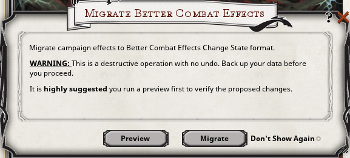

 
# Better Combat Effects

**Current Version:** 4.22
**Updated:** 01/23/24

Better Combat Effects is an extension that allows for fine tuning of when effects are enabled, disabled, removed, and added.
<a href="https://www.fantasygrounds.com/forums/showthread.php?68831-Better-Combat-Effects" target="_blank">Comments and Bug Reports</a>

Better Combat Effects supports Effect Builder, a GUI for building effects
<a href="https://forge.fantasygrounds.com/shop/items/457/view" target="_blank">Effect Builder</a>
<a href="https://forge.fantasygrounds.com/shop/items/463/view" target="_blank">Effect Builder Plugin 5E</a>
<a href="https://forge.fantasygrounds.com/shop/items/464/view" target="_blank">Effect Builder Plugin 3.5E/PFRPG</a>
## BCE Modifier Tags

| Color| Rulesets Supported|
| ---| ---|
| Green| 5E, 3.5E, PFRPG, SFRPG|
| Magenta| 4E|
| Orange| 5E|
| Purple| 5E, 4E|

| Modifier| Value| Descriptors| Notes| Ruleset|
| ---| ---| ---| ---| ---|
| **Add Effect**| | | | |
| DMGA| (D)| [damage type]* | Apply damage when the effect is added| |
| REGENA| (D)| | One time regeneration when the effect is added| |
| SAVEA| (N) or [SDC]| [ability] (R) (RA) (D) (H) (M) (F)| Roll ongoing save when effect is added where (N) is a number or [SDC]| 5E 3.5E PFRPG SFRPG|
| TREGENA| (D)| | One time regeneration to temporary HP when the effect is added| |
| **Attack**| | | | |
| ATKDS| (-)| | DEACTIVATE effect if the source of the effect is attacked| 4E|
| **Damage**| | | | |
| DMGAT|(-)| | Activate effect when damage is taken| |
| DMGDT|(-)| | Deactivate effect when damage is taken| |
| DMGRT|(-)| | Remove effect when damage is take| |
| TDMGADDT|(-)| [effect] | TARGET of the attack will add an effect to the TARGET (itself) when damage is done| |
| TDMGADDS|(-)| [effect] | TARGET of the attack will add an  effect to the SOURCE of the attack when damage is done| |
| SDMGADDT|(-)| [effect] | SOURCE of the attack will add an effect to the TARGET when damage is done| |
| SDMGADDS|(-)| [effect] | SOURCE of the attack will add an effect to the SOURCE (itself) when damage is done| |
| DMGR|(D)| [damage type]* ,all, [range]* | Reduce the damage taken by the specified damage type(s) by (D)| 5E 4E|
| SAVEONDMG|(N) or [SDC]| [ability] (R) (RA) (D) (H) (M) (F)| Roll ongoing save when the  Actor's takes damage where (N) is a number or [SDC]| 5E 3.5E PFRPG SFRPG|
| **Expire Effect** | | | | |
| EXPIREADD|(-)| [effect] or [condition] | Add effect or condition when this effect expires| |
| **Misc** | | | | |
| DC|(N)|  |(N) will be added  to the [SDC] when [SDC] is automatically replaced| 5E|
| DUR|(N)|(-)| Sets this effects duration to (N) when applied| |
| **Ongoing Damage** | | | | |
| DMGOE|(D)| [damage type]* | Apply ongoing damage at the END of the Actor's turn| |
| SDMGOS|(D)| [damage type]* | Apply ongoing damage at the START of the Actor's turn who applied the effect| |
| SDMGOE|(D)| [damage type]* | Apply ongoing damage at the END of the Actor's turn who applied the effect| |
| **Ongoing Regeneration** | | | | |
| REGENE|(D)| | Apply regeneration at the END of the Actor's turn| |
| SREGENS|(D)| | Apply regeneration at the START of the Actor's turn who applied the effect| |
| SREGENE|(D)| | Apply regeneration at the END of the Actor's turn who applied the effect| |
| STREGENS|(D)| | Apply regeneration to temporary HP at the START of the Actor's turn who applied the effect| |
| STREGENE|(D)| | Apply regeneration to temporary HP at the END of the Actor's turn who applied the effect| |
| TREGENS|(D)| | Apply regeneration to temporary HP at the START of the Actor's turn| |
| TREGENE|(D)| | Apply regeneration to temporary HP at the END of the Actor's turn| |
| **Ongoing Save** | | | | |
| SAVES| (N) or [SDC]| [ability] (R) (RA) (D) (H) (M) (F)| Roll ongoing save at the START of the Actor's turn where (N) is a number or [SDC]| 5E 3.5E PFRPG SFRPG|
| SAVEE| (N) or [SDC]| [ability] (R) (RA) (D) (H) (M) (F)| Roll ongoing save at the END of the Actor's turn where (N) is a number or [SDC]where (N) is a number or [SDC]| 5E 3.5E PFRPG SFRPG|
| SAVEDMG| (D)| [damage type]*| Damage done on failed ongoing save| 5E 3.5E PFRPG SFRPG|
| SAVEADD| (-)| [effect] or [condition]| Add effect or condition on a failed ongoing save| 5E 3.5E PFRPG SFRPG|
| SAVEADDP| (-)| [effect] or [condition]| Add effect or condition on a successful ongoing save| 5E 3.5E PFRPG SFRPG|
| **Rest** | | | | |
| RESTS|(-)| | Remove effect when the Actor takes a short rest| |
| RESTL|(-)| | Remove effect when the Actor takes a short or long rest| |
| **Stack**| | | | |
| STACK| (-)| | Multiple of this effect is allow to be applied. The option "Allow Duplicate Effects" must be set to off| 5E 3.5E PFRPG SFRPG|
| **Turn** | | | | |
| TURNAS|(-)| | DEPRECATED -  ACTIVATE effect on the START of the Actor’s turn| |
| TURNDS(-) | | DEPRECATED -  DEACTIVATE effect on the START of the Actor’s turn| |
| TURNRS| (-)| | DEPRECATED -  REMOVE effect on the START of the Actor’s turn if current duration is 1 | |
| TURNAE| (-)| | DEPRECATED -  ACTIVATE effect on the END of the Actor’s turn| |
| TURNDE| (-)| | DEPRECATED -  DEACTIVATE effect on the END of the Actor’s turn| |
| TURNRE| (-)| | DEPRECATED -  REMOVE effect on the END of the Actor’s turn if current duration is 1 | |
| STURNRS| (-)| | DEPRECATED -  REMOVE effect on the START of the Actor’s turn who applied the effect if current duration is 1| |
| STURNRE| (-)| | DEPRECATED -  REMOVE effect on the END of the Actor’s turn who applied the effect if current duration is 1| |

**DEPRECATED** = Will be removed in the future. Use Change State Cycler (see below) \
**(D)** = Dice and numbers supported for value attribute \
**(N)** = Only numbers supported for value attribute \
**(-)** = Neither number nor dice supported for value attribute \
**(T)** = Effects can be targeted to only apply to modifiers against certain opponents \
**[range]** = melee, ranged \
**[damage type]** = acid, cold, fire, force, lightning, necrotic, poison, psychic, radiant, thunder, adamantine, bludgeoning, cold-forged iron, magic, piercing, silver, slashing \
**[stat]** = strength, constitution, dexterity, intelligence, wisdom, charisma \
**[ability]** = STR, CON, DEX, INT, WIS, CHA, (FORTITUDE, REFLEX, WILL) - 3.5E \
**[skill]** = any skill name \
**[effect]** = Any effect label in the custom effect list. Effect label is defined as anything before the first ; i.e. My Custom; ATKDS; "My Custom" would be the effect label \
**[condition]** = Any condition as noted above except exhaustion. Note [condition] must be all lower case \
**[SDC]** = (5E only) [SDC] will be replaced by the 8 + Actors spellcasting ability modifier + [PRF]. Alternatively [SDC] can be explicitly defined such as 8,[INT],[PRF] \
**(R)** will remove the save effect on a successful save. \
**(RA)** will remove the save effect on any save. \
**(D)** will disable the save effect on a successful save. \
**(H)** will deal half damage on a successful ongoing save. \
**(M)** will indicate this is magical so any creature will magic resistance will gain proper advantage on the save \
**(F)** will invert the roll. SAVEDMG, (R), (RA), (D), (H) will be performed on a failed save rather than successful one \
***** = Multiple entries of this descriptor type allowed

## Change State
A change state cycler has been added to the combat tracker, custom effects list, and Effect Dialog.

| Icon| Shorthand| Description|
| --| --| --|
| | ATS| ACTIVATE effect on the START of the ANY Actor’s turn|
| | DTS| DEACTIVATE effect on the START of the ANY Actor’s turn|
| | RTS| REMOVE effect on the START of the ANY Actor’s turn when the duration is 1|
| | AS| ACTIVATE effect on the START of the Actor’s turn|
| | DS| DEACTIVATE effect on the START of the Actor’s turn|
| | RS| REMOVE effect on the START of the Actor’s turn  when the duration is 1|
| | AE| ACTIVATE effect on the END of the Actor’s turn|
| | DE| DEACTIVATE effect on the END of the Actor’s turn|
| | RE| REMOVE effect on the END of the Actor’s turn  when the duration is 1|
| | SAS| ACTIVATE effect on the START of the Actor’s turn who applied the effect|
| | SDS| DEACTIVATE effect on the START of the Actor’s turn who applied the effect|
| | SRS| REMOVE effect on the START of the Actor’s turn  when the duration is 1|
| | SAE| ACTIVATE effect on the END of the Actor’s turn who applied the effect|
| | SDE| DEACTIVATE effect on the END of the Actor’s turn who applied the effect|
| | SRE| REMOVE effect on the END of the Actor’s turn who applied the effect when the duration is 1|

Additionally, DUSE has been added to the APPLY cycler \

| Icon| Shorthand| Description|
| --| --| --|
| | DUSE| DEACTIVATE effect when the effect has been used|

## Examples

| Power [Source]| Effect Code| Duration/Target/Expend| Notes|
| ---| ---| ---| ---|
| Belt of Frost Giant Strength [Item]| Belt of Frost Giant Strength; STR: 19-X| Targeting=Self| |
| Cloak of Displacement [Item], Displacer Beast [NPC]| Displacement; GRANTDISATK; DMGDT| Targeting=Self, ChangeState=AS| |
| Deflect Missiles [Class - Monk]| Deflect Missiles; DMGR: 1d10 [MONK],[DEX],ranged,bludgeoning,piercing| Targeting=Self| |
| Dominate Person [Spell]| Dominate Person; SAVEONDMG: [SDC] WIS (R)| | |
| Dragon [NPC]| Frightful Presence; Frightened; SAVEE: 16 WIS (R)| | |
| General Action| Dodge;| Targeting=Self, ChangeState=RS| |
| Ghoul [NPC]| Ghoul Claws; SDMGADDT: GOTU| Targeting=Self| GTOU is an effect in the custom effects list|
| Ghoul [NPC]| GOTU; Paralyzed; SAVEA: 10 CON (R); SAVEE: 10 CON (R)| | |
| Headband of Intellect [Item]| Headband of Intellect; INT: 19-X| Targeting=Self| |
| Heavy Armor Master [Feat]| Heavy Armor Master; DMGR: 3 slashing, bludgeoning, piercing, !magic| Targeting=Self| |
| Interception Fighting Style [Class - Fighter]| Interception Fighting Style; DMGR: 1d10 [PRF],all| | |
| Turn Undead [Class - Cleric]| Turn Undead; Turned; DMGRT| Duration=1 Min| |
| Shadow [NPC]| Shadow; SDMGADDT: Strength Drain| Target=Self| Strength Drain is an effect in the custom effects list|
| Shadow [NPC]| Strength Drain; STR: -1d4; STACK; RESTL| | |
| Shield of the 300 [Item]| Shield of the 300; TDMGADDT: Shield of the 300 Bonus| Targeting=self| Shield of the 300 Bonus is an effect in the custom effects list|
| Shield of the 300 [Item]| Shield of the 300 Bonus; AC: 1; STACK| ChangeState=RS| |
| Sleep [Spell]| Sleep; Unconscious; DMGRT| Duration=1 Min| |
| Spirit Guardians (Spell)| Spirit Guardians; (C); AURA: 15 enemy,neutral,single; ($) Spirit Guardians; IF: FACTION(!self); SAVEA: [SDC] WIS (M) (H); SAVES: [SDC] WIS (M) (H); SAVEDMG: 3d8 radiant| Targeting=Self| Requires Aura Extension|
| Storm Desert [Class - Barbarian]| AURA: 10 all; Barbarian Raging Storm Desert; DMGA: 2 fire| Targeting=Self| Requires Aura Extension|
| Stunning Strike [Class - Monk]| Stunning Strike; Stunned;| Duration=1 Rnd, ChangeState=SRE| |
| Vitriolic Sphere [Spell]| Vitriolic Sphere; DMGOE: 5d4 acid| Duration=2 Rnd| |
| Wall of Thorns [Spell]| Wall of Thorns; SAVEE: [SDC] DEX (H)(C); SAVEDMG: 7d8 slashing| | |
| Water Elemental [NPC]| Water Elemental Whelm; grappled; restrained; SDMGOS: 2d8+4 bludgeoning| | |
| Web [Spell]| Web; Restrained; SAVES: [SDC] DEX (C)| | |

## Migrate Deprecated Effects

Deprecated change state tags can be auto migrated for a campaign with the Effects Migrator. A popup box will appear when the table is started such as below.

<u>It is highly recommended the campaign is backed up before performing migration.</u>

Preview will produce a story entry of the migration changes without writing those changes to the database. Review these changes prior to migration. Some changes may be suggested to effects that do not change state and those changes are likely cleanup of extra whitespace or ;

If the suggested changes are acceptable, use Migrate to migrate effects to the new change state cycyler. This will also create a story entry detailing the changes made to the database. You may want to delete these story entries after the migration, especially if you are creating a module for distribution.

You can also bring up the migrate effects popup with the slash command: **/migrate_effects**

## Options

| Name| Default| Options| Notes| Ruleset|
| ---| ---| ---| ---| ---|
| Allow Duplicate Effects| on| off/on| When off, will not allow duplicate effects (same name, duration, actor who applied the effect) on an Actor| 5E|
| Consider Duplicate Duration| off| off/on| When on, considers Concentration duration when determining if previous concentration effects should expire| 5E|
| Deprecate Change State Tags| off| off/on| When on, TURNAS, TURNDS, TURNRS, TURNAE, TURNDE, TURNRE, STURNRS, STURNRE will no longer process and there is a performance increase on change of turn| |
| Experimental: Autoparse NPC Powers| off| off/on| When on, will autoparse powers and automatically create effects for: DMGOE, SDMGOS, SDMGEOE, SAVES, SAVEE| 5E|
| Restrict Concentration| off| off/on| When on, expires any previous spells with concentration (C) when a new concentration spell is cast| 5E|
| TempHP Reduction is Damage| on| off/on| For purposes of determining if something should happen if an actor takes damage. When off, if an actor takes damage that reduces their Temp HP only and NOT their HP (takes wounds), that reduction is not considered damage| |

### Add Effect on Damage Modifiers

Effects can be automatically added to the source or the target on the damage by either the source of the damage or the target of the damage. For this to work we need two different effects.  Example:

* Shadow; SDMGADDT: Strength Drain

The Shadow has strength drain so we put the above effect on the shadow. When the shadow deals damage, it will apply the effect "Strength Drain" to the target of the damage. The effect "Strength Drain" needs to be an effect listed in our custom effects list or conditions table. The effect looks like this:

* Strength Drain; STR: -1d4; STACK; RESTL
